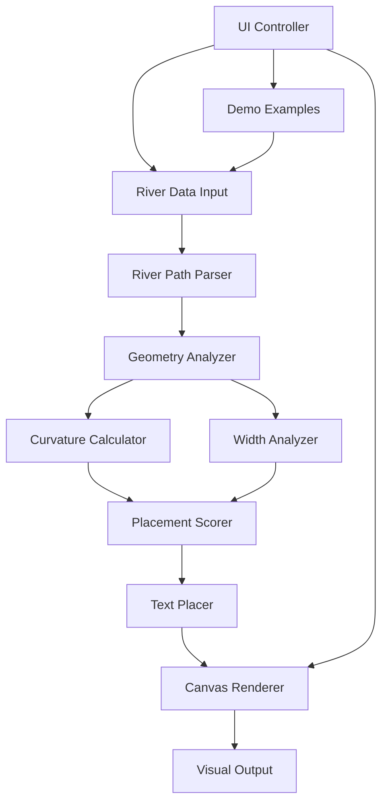

# Design Document: Smart River Name Placement

## Overview

The Smart River Name Placement system is a client-side web application that intelligently positions text along river paths for optimal readability. The system uses geometric analysis to evaluate river characteristics (curvature, width, straightness) and calculates placement scores to determine the best location for text rendering.

The architecture follows a pipeline approach:
1. **Input Processing**: Parse river coordinate data
2. **Geometry Analysis**: Calculate curvature, identify problematic sections
3. **Placement Scoring**: Evaluate potential text positions
4. **Text Rendering**: Draw river and text on HTML5 canvas

Given the hackathon timeline (2 days), the design prioritizes:
- Simple, understandable algorithms
- Visual clarity for demonstration
- Minimal dependencies (vanilla JavaScript + HTML5 Canvas)
- Fast execution for real-time demo

## Architecture



### Component Layers

1. **Data Layer**: River path representation and geometry data structures
2. **Analysis Layer**: Geometric calculations and scoring algorithms
3. **Rendering Layer**: Canvas-based visualization
4. **UI Layer**: User interaction and demo controls

## Components and Interfaces

### 1. River Path Parser

**Purpose**: Convert input coordinate data into structured river path representation.

**Interface**:
```javascript
class RiverPathParser {
  // Parse coordinate array into RiverPath object
  // Input: Array of [x, y] or [x, y, width] coordinates
  // Output: RiverPath object or Error
  parse(coordinates: Array<[number, number]> | Array<[number, number, number]>): RiverPath | Error
  
  // Validate coordinate data
  validate(coordinates: Array): ValidationResult
}
```

**Key Responsibilities**:
- Validate minimum 3 points
- Extract width data if present
- Create RiverPath data structure
- Handle malformed input gracefully

### 2. Geometry Analyzer

**Purpose**: Analyze river shape characteristics to identify suitable text placement areas.

**Interface**:
```javascript
class GeometryAnalyzer {
  // Calculate curvature at each point along the path
  // Returns array of curvature values (degrees per unit distance)
  calculateCurvature(path: RiverPath): Array<number>
  
  // Identify segments with excessive curvature (> 30 deg/unit)
  findSharpCurves(path: RiverPath, threshold: number = 30): Array<Segment>
  
  // Find narrow sections below width threshold
  findNarrowSections(path: RiverPath, minWidth: number): Array<Segment>
  
  // Identify edge sections (first/last 10% of path)
  getEdgeSections(path: RiverPath): {start: Segment, end: Segment}
  
  // Calculate overall geometry metrics
  analyzeGeometry(path: RiverPath): GeometryMetrics
}
```

**Curvature Calculation**:
- Use three consecutive points to form two vectors
- Calculate angle between vectors
- Normalize by distance to get degrees per unit
- Smooth using moving average (window size 3)

**Algorithm**:
```
For each point i in path (excluding first and last):
  vector1 = point[i] - point[i-1]
  vector2 = point[i+1] - point[i]
  angle = arccos(dot(vector1, vector2) / (|vector1| * |vector2|))
  distance = (|vector1| + |vector2|) / 2
  curvature[i] = angle / distance
```

### 3. Placement Scorer

**Purpose**: Evaluate potential text placement positions and assign scores.

**Interface**:
```javascript
class PlacementScorer {
  // Score a specific segment for text placement
  // Returns score 0-100 (higher is better)
  scoreSegment(path: RiverPath, startIdx: number, length: number, metrics: GeometryMetrics): number
  
  // Find all candidate positions for text of given length
  findCandidates(path: RiverPath, textLength: number, metrics: GeometryMetrics): Array<Candidate>
  
  // Select optimal placement from candidates
  selectOptimal(candidates: Array<Candidate>): Candidate
}
```

**Scoring Algorithm**:

Each candidate segment receives a score based on multiple factors:

1. **Curvature Score (40% weight)**:
   - Average curvature along segment
   - Score = max(0, 100 - avgCurvature * 3)
   - Penalizes curved sections heavily

2. **Width Score (20% weight)**:
   - Average width along segment (if available)
   - Score = min(100, (avgWidth / idealWidth) * 100)
   - Penalizes narrow sections

3. **Position Score (20% weight)**:
   - Distance from path edges
   - Score = 100 * (1 - abs(centerDistance / maxDistance))
   - Prefers center positions

4. **Straightness Score (20% weight)**:
   - Variance in direction along segment
   - Score = max(0, 100 - directionVariance * 5)
   - Rewards consistent direction

**Final Score**: Weighted sum of all factors (0-100 scale)

### 4. Text Placer

**Purpose**: Calculate exact character positions and rotations along the selected path segment.

**Interface**:
```javascript
class TextPlacer {
  // Calculate position and rotation for each character
  placeText(text: string, path: RiverPath, startIdx: number, fontSize: number): Array<CharacterPlacement>
  
  // Interpolate position along path at specific distance
  interpolatePosition(path: RiverPath, startIdx: number, distance: number): {x: number, y: number, angle: number}
}
```

**Text Placement Algorithm**:
```
1. Measure character widths (using canvas measureText)
2. Calculate total text length
3. For each character:
   a. Calculate distance along path from start
   b. Interpolate position at that distance
   c. Calculate tangent angle at position
   d. Store {x, y, angle, char}
4. Return array of character placements
```

### 5. Canvas Renderer

**Purpose**: Visualize river paths and placed text on HTML5 canvas.

**Interface**:
```javascript
class CanvasRenderer {
  // Draw river path with optional width visualization
  drawRiver(path: RiverPath, ctx: CanvasRenderingContext2D, options: RenderOptions): void
  
  // Draw text along path using character placements
  drawText(placements: Array<CharacterPlacement>, ctx: CanvasRenderingContext2D, options: TextOptions): void
  
  // Visualize rejected areas (sharp curves, narrow sections)
  drawRejectedAreas(segments: Array<Segment>, ctx: CanvasRenderingContext2D): void
  
  // Draw candidate positions with scores
  drawCandidates(candidates: Array<Candidate>, ctx: CanvasRenderingContext2D): void
  
  // Clear and reset canvas
  clear(ctx: CanvasRenderingContext2D): void
}
```

**Rendering Strategy**:
- River: Blue stroke with variable width if Width_Profile available
- Text: Black fill with white outline for contrast
- Rejected areas: Red semi-transparent overlay
- Candidates: Green circles with score labels
- Selected position: Bright green highlight

### 6. UI Controller

**Purpose**: Manage user interactions and coordinate system components.

**Interface**:
```javascript
class UIController {
  // Load and display example river
  loadExample(exampleId: string): void
  
  // Process custom river input
  processCustomInput(coordinates: string): void
  
  // Update river name and re-render
  updateRiverName(name: string): void
  
  // Toggle visualization options
  toggleVisualization(option: string, enabled: boolean): void
  
  // Display metrics and algorithm explanation
  displayMetrics(metrics: GeometryMetrics, placement: Candidate): void
}
```

## Data Models

### RiverPath
```javascript
{
  points: Array<{x: number, y: number}>,  // Coordinate points
  widths: Array<number> | null,            // Optional width at each point
  length: number,                          // Total path length
  bounds: {minX, maxX, minY, maxY}        // Bounding box
}
```

### GeometryMetrics
```javascript
{
  curvatures: Array<number>,              // Curvature at each point
  sharpCurves: Array<Segment>,            // Segments with high curvature
  narrowSections: Array<Segment>,         // Segments with low width
  edgeSections: {start: Segment, end: Segment},
  avgCurvature: number,
  maxCurvature: number
}
```

### Segment
```javascript
{
  startIdx: number,                       // Start point index
  endIdx: number,                         // End point index
  length: number,                         // Segment length
  reason: string | null                   // Rejection reason if applicable
}
```

### Candidate
```javascript
{
  segment: Segment,                       // Path segment
  score: number,                          // Placement score (0-100)
  scores: {                               // Individual score components
    curvature: number,
    width: number,
    position: number,
    straightness: number
  },
  centerPoint: {x: number, y: number}    // Visual center of placement
}
```

### CharacterPlacement
```javascript
{
  char: string,                           // Character to render
  x: number,                              // X position
  y: number,                              // Y position
  angle: number,                          // Rotation angle (radians)
  width: number                           // Character width
}
```

## Correctness Properties


*A property is a characteristic or behavior that should hold true across all valid executions of a system—essentially, a formal statement about what the system should do. Properties serve as the bridge between human-readable specifications and machine-verifiable correctness guarantees.*

### Property 1: Valid coordinate parsing preserves structure
*For any* valid coordinate array with at least 3 points, parsing should produce a RiverPath object with the same number of points and preserve any width data provided.
**Validates: Requirements 1.1, 1.3, 1.4**

### Property 2: Invalid input produces errors
*For any* invalid coordinate input (fewer than 3 points, non-numeric values, malformed arrays), the parser should return an error rather than a RiverPath object.
**Validates: Requirements 1.2**

### Property 3: Curvature calculation completeness
*For any* RiverPath with N points, the geometry analyzer should produce N-2 curvature values (excluding endpoints) and all values should be non-negative numbers.
**Validates: Requirements 2.1**

### Property 4: Sharp curve detection
*For any* RiverPath, all segments identified as sharp curves should have average curvature exceeding the threshold (30 degrees per unit distance).
**Validates: Requirements 2.2**

### Property 5: Narrow section detection
*For any* RiverPath with width data, all segments identified as narrow should have average width below the specified minimum threshold.
**Validates: Requirements 2.3**

### Property 6: Edge section exclusion
*For any* RiverPath, the identified edge sections should cover exactly the first and last 10% of the path length, and these sections should be excluded from placement candidates.
**Validates: Requirements 2.5**

### Property 7: Placement score validity and optimal selection
*For any* set of candidate positions, all scores should be in the range [0, 100], and the selected position should have the highest score (or be closest to center if tied).
**Validates: Requirements 2.4, 3.1, 3.3**

### Property 8: Text orientation smoothness
*For any* text placement along a path, the angle change between consecutive characters should not exceed 15 degrees to ensure smooth orientation transitions.
**Validates: Requirements 3.2**

### Property 9: Text length constraint
*For any* selected placement segment, the segment length should be at least as long as the total text length (sum of character widths).
**Validates: Requirements 3.4**

### Property 10: Character placement completeness
*For any* text string and path segment, the renderer should generate exactly one CharacterPlacement for each character in the string, with valid x, y, and angle values.
**Validates: Requirements 4.1, 4.2**

### Property 11: Width visualization conditional rendering
*For any* RiverPath, if width data exists, the rendering should use variable-width drawing; if width data is absent, the rendering should use constant-width drawing.
**Validates: Requirements 4.4**

### Property 12: Rejected area visualization
*For any* set of rejected segments (sharp curves, narrow sections), each segment should trigger a visual indicator with an associated rejection reason.
**Validates: Requirements 4.5, 7.2**

### Property 13: Error messages for all errors
*For any* error condition (invalid input, no suitable placement, etc.), the system should produce a descriptive error message string.
**Validates: Requirements 6.5**

### Property 14: Candidate transparency
*For any* placement calculation, the system should return at least the top 3 candidates (or all candidates if fewer than 3 exist) with their scores and score breakdowns.
**Validates: Requirements 7.1**

### Property 15: Metrics availability
*For any* selected placement, the system should provide numerical metrics including average curvature, width (if available), position score, and straightness score.
**Validates: Requirements 5.3, 7.3, 7.5**

## Error Handling

### Input Validation Errors
- **Insufficient points**: Return error "River path must have at least 3 coordinate points"
- **Invalid coordinates**: Return error "Coordinates must be numeric [x, y] or [x, y, width] arrays"
- **Malformed data**: Return error with specific parsing issue

### Analysis Errors
- **No suitable placement**: Return warning "No ideal placement found" with best available option
- **Text too long**: Return warning "Text length exceeds longest suitable segment" with truncation suggestion
- **Extreme geometry**: Return warning "River geometry is highly irregular" with placement caveats

### Rendering Errors
- **Canvas unavailable**: Gracefully degrade to data-only mode
- **Font loading failure**: Fall back to default system font

### Error Recovery Strategy
1. Validate input early and fail fast with clear messages
2. Provide fallback options when ideal conditions aren't met
3. Never crash - always return best-effort results with warnings
4. Log errors to console for debugging during hackathon demo

## Testing Strategy

### Dual Testing Approach

The system will use both unit tests and property-based tests for comprehensive coverage:

**Unit Tests**: Focus on specific examples, edge cases, and integration points
- Example river shapes (straight line, gentle curve, sharp bend)
- Boundary conditions (minimum 3 points, empty width data)
- Error conditions (invalid input formats)
- Integration between components (parser → analyzer → scorer → renderer)

**Property-Based Tests**: Verify universal properties across randomized inputs
- Use **fast-check** library for JavaScript property-based testing
- Minimum **100 iterations** per property test
- Generate random river paths with varying characteristics
- Verify properties hold for all generated inputs

### Property Test Configuration

Each property test will:
1. Use fast-check to generate random test data
2. Run minimum 100 iterations (configurable higher for thorough testing)
3. Include a comment tag: **Feature: smart-river-name-placement, Property N: [property text]**
4. Reference the specific design property being validated

Example property test structure:
```javascript
// Feature: smart-river-name-placement, Property 1: Valid coordinate parsing preserves structure
fc.assert(
  fc.property(
    fc.array(fc.tuple(fc.float(), fc.float()), {minLength: 3, maxLength: 50}),
    (coords) => {
      const path = parser.parse(coords);
      return path.points.length === coords.length;
    }
  ),
  { numRuns: 100 }
);
```

### Test Coverage Goals

- **Parser**: 100% coverage (critical for data integrity)
- **Geometry Analyzer**: 90%+ coverage (complex algorithms)
- **Placement Scorer**: 90%+ coverage (core algorithm)
- **Text Placer**: 85%+ coverage (mathematical calculations)
- **Renderer**: 70%+ coverage (visual output, harder to test)
- **UI Controller**: 60%+ coverage (integration and user interaction)

### Testing Priorities for Hackathon Timeline

Given the 2-day deadline, prioritize:
1. **Day 1 Morning**: Core algorithm tests (parser, analyzer, scorer)
2. **Day 1 Afternoon**: Property-based tests for critical properties
3. **Day 2 Morning**: Integration tests and visual validation
4. **Day 2 Afternoon**: Manual testing with demo examples

### Manual Testing Checklist

Before hackathon presentation:
- [ ] Test all 3+ example rivers render correctly
- [ ] Verify text placement looks visually appealing
- [ ] Confirm rejected areas are highlighted properly
- [ ] Check that metrics display correctly
- [ ] Test custom river name input
- [ ] Verify performance (< 100ms for typical rivers)
- [ ] Test on presentation laptop/screen resolution
- [ ] Ensure error messages display for invalid input

## Implementation Notes

### Technology Stack
- **HTML5 Canvas**: For rendering (no external graphics libraries)
- **Vanilla JavaScript**: Keep dependencies minimal
- **fast-check**: For property-based testing
- **Jest or Vitest**: For test runner (whichever is faster to set up)

### Performance Considerations
- Target < 100ms total processing time for typical rivers (50-100 points)
- Use simple O(n) algorithms where possible
- Avoid complex optimization (not needed for demo scale)
- Cache geometry calculations to avoid recomputation

### Visual Design Principles
- High contrast for readability (blue river, black text with white outline)
- Clear visual indicators (red for rejected, green for candidates)
- Clean, minimal UI to focus attention on the algorithm
- Large canvas (800x600 minimum) for clear demonstration

### Hackathon Demo Strategy
1. Start with simple straight river (shows basic functionality)
2. Show curved river (demonstrates curvature analysis)
3. Show complex river with branches (highlights algorithm intelligence)
4. Explain scoring algorithm with visual metrics
5. Show rejected areas and explain why
6. Take questions and demonstrate custom inputs

### Future Enhancements (Post-Hackathon)
- Support for branching rivers (multiple text placements)
- Interactive editing of river paths
- Export to SVG or other map formats
- Advanced typography (font selection, sizing)
- Multi-line text for long river names
- Integration with real map data (GeoJSON)
